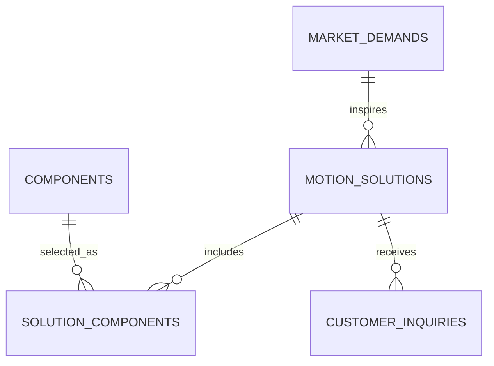

# OPC V1 产品与 Motion Solution 平台设计

## 1. 目标与范围

OPC V1 是面向消费电子、智能硬件和机器人客户的产品与 Motion Solution 展示平台。平台让内部团队把市场需求沉淀为可发布的方案和组件组合，并将客户咨询收集为可人工处理的询盘。

V1 成功标准是跑通以下闭环：

```text
Market Demand → Motion Solution → Component BOM → Published Web Page → Customer Inquiry
```

V1 不包含供应商档案、供应商匹配、供应商联系方式、AI 自动回复、自动邮件、自动抓取和 AI 自动生成方案。供应链调研属于平台外部的内部工作日报，不进入本项目的数据模型或用户界面。

## 2. 用户与访问边界

- 访客：可浏览已发布的产品、组件和 Motion Solution；可提交询盘；可在显著位置联系 `chinajpq@outlook.com`。
- 管理员：使用 Supabase Auth 登录后台，维护市场需求、组件、方案与询盘状态。
- 供应商：不属于 V1 平台用户，也没有任何对外资料页或联系方式。

公开页面使用“产品与方案咨询”描述该邮箱，不将其标识为供应商邮箱。

## 3. 技术架构

```text
Astro SSR
├─ 公开产品/方案页面
├─ 受保护的后台管理页面
└─ 询盘 API 端点
        ↓
Supabase
├─ Auth（管理员）
├─ PostgreSQL（业务数据）
└─ Row Level Security（公开读取与管理写入）
```

Astro 采用 TypeScript 和 SSR 输出模式。浏览器不持有 Supabase service-role key；公开询盘经 Astro 服务端端点校验后写入。Supabase anon key 只用于适合公开读取的场景，管理员操作通过登录会话和 RLS 策略授权。

## 4. 数据模型

V1 有四张核心业务表和一张关联表：



### `market_demands`

记录市场机会和方案设计依据：行业、应用、产品名称、客户类型、区域、客户痛点、运动需求、技术需求、市场优先级、商业价值、状态和创建/更新时间。技术需求使用 JSONB，以容纳不同产品类别的规格。

状态：`draft`、`validated`、`archived`。

### `components`

记录可复用的产品组件：组件类型、型号、结构化规格、适用应用、是否对外展示和时间戳。组件没有供应商字段。

### `motion_solutions`

记录可发布的方案资产：关联市场需求、名称、唯一 slug、应用、运动类型、方案说明、目标客户、优先级、发布状态、SEO 标题/描述与时间戳。

状态：`draft`、`review`、`published`、`archived`。仅 `published` 方案可被公开读取。

### `solution_components`

方案 BOM 关联表。记录一个方案使用哪些组件，以及组件角色、数量、排序和说明。它取代了不具扩展性的 JSON 组件列表。

### `customer_inquiries`

记录客户提交的询盘：关联方案、姓名、公司、国家、邮箱、应用、需求说明、需求数量、状态、后台备注和时间戳。

状态严格采用：`new`、`reviewing`、`quoted`、`closed`。V1 不发自动回复，由管理员人工完成评估和反馈。

## 5. 关键工作流

### 内容发布

1. 管理员录入并验证一条 Market Demand。
2. 管理员由需求创建草稿 Motion Solution。
3. 管理员配置 Solution BOM，关联至少三个组件。
4. 管理员审核并发布方案。
5. 公开站自动展示该方案详情页。

### 询盘处理

1. 访客在已发布方案详情页填写询盘。
2. Astro API 验证必填项、方案发布状态和数量，再插入 `customer_inquiries`。
3. 管理员在后台查看并将状态更新为 `reviewing`、`quoted` 或 `closed`，并记录内部备注。
4. 管理员通过 `chinajpq@outlook.com` 与客户人工沟通。

## 6. 页面与后台范围

公开端：首页、Solutions 列表、动态 Solution 详情、Components 列表/分类、工程支持说明、询盘表单。首页、导航、页脚和方案详情页放置醒目的“产品与方案咨询”邮箱链接。

后台：登录、市场需求管理、组件管理、方案与 BOM 管理、询盘列表及状态更新。不做仪表盘、复杂搜索、附件、邮件通知、AI 助手或供应商模块。

## 7. 错误处理、安全与验证

- 公开 API 返回字段级校验错误，不泄露内部数据库错误。
- 仅管理员可写入内容和读取询盘；公开端只读已发布方案与可展示组件。
- 表单在服务端验证姓名、邮箱、需求描述、方案 ID、数量和方案状态。
- 所有内容采用归档状态，不执行业务数据物理删除。
- 单元测试覆盖表单校验和状态转换；集成测试覆盖“发布方案→提交询盘”的最小闭环。

## 8. V1 验收条件

管理员可以创建一条市场需求、一个关联方案以及至少三个组件，发布方案后访客可在公开详情页看到方案和组件，并通过表单创建一条 `new` 询盘；管理员可在后台将询盘更新为 `reviewing`、`quoted` 或 `closed`。整个过程中不出现供应商数据或供应商联系方式。
